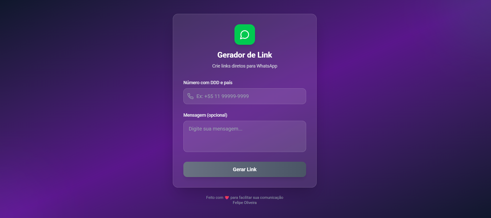

# 📱 WhatsApp Link Generator

Uma aplicação web simples desenvolvida com **React + Vite** que permite gerar links personalizados do WhatsApp com uma mensagem padrão.

## 🚀 Demonstração

Acesse a aplicação em: [whatsapp-link-generator-gold.vercel.app](https://whatsapp-link-generator-gold.vercel.app)

## 🖼️ Preview



## 🛠 Tecnologias Utilizadas

- [React](https://reactjs.org/)
- [Vite](https://vitejs.dev/)
- JavaScript

## 📦 Funcionalidades

- Geração de links do WhatsApp com número e mensagem personalizada
- Interface simples e intuitiva
- Link gerado com visualização e botão para copiar

## 📦 Instalação

Siga os passos abaixo para rodar o projeto localmente:

```bash
# Clone o repositório
git clone https://github.com/felipeoliveiracode/whatsapp-link-generator.git

# Acesse o diretório
cd whatsapp-link-generator

# Instale as dependências
npm install

# Inicie o servidor de desenvolvimento
npm run dev
